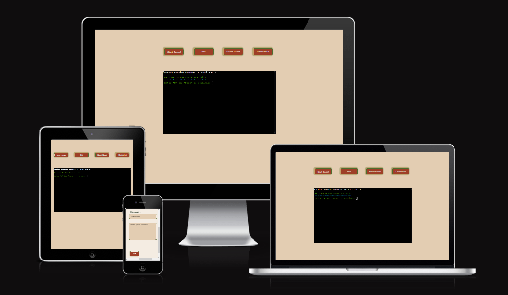

Who is in the __Festive Spirit__, __Chrismas Quiz__.

# Welcome to Python Project 3 Inpired by Chrismas. 

The project is a multiple question quiz game, created around the chrismas vocabulory and historic origin. It is a light-hearted fun game that can be played with friends or family. It is a fun and cheerful game, with educational fun facts. The programming languages used in this quiz are **HTML**, **CSS**, **Python** and **JavaScript**. To showcase what I have learned so far with the program.   

[Festive Spirit, Chrismas Quiz](https://quizgamepp3-505317fd75c2.herokuapp.com/)
(Note: Ctrl + click to open in a new tab)

## Table of Content

1. [User Experience](#user-experience)
    1. [Project Goal](#project-goal)
    2. [User Story](#user-story)
    3. [Typography](#typography)
    4. [Flowchat](#flowchat)
2. [Project Design](#project-design)
    1. [Planning Stage](planning-stage)
        1. [Landing Window](#landing-window)
        2. [Game Window](#game-window)
        3. [About Us Window](#about-window)
        4. [Contact Us window](#contact-window)
    2. [Features](#features)
        1. [Landing window](#landing-window)
        2. [Start Game](#start-game)
        2. [Info Page](#info-page)
        3. [Score Board Page](#score-board-page)
        4. [Contact Us Page](#contact-us-page)
3. [Technologies](#technologies)
    1. [Code Languages](#code-languages)
    2. [Frameworks Used](#frameworks-used)
    3. [Extra Support](#extra-support)
    4. [Technologies used for testing](#technologies-used-for-testing)
4. [Testing](#testing)
    1. [Debugging](#debugging)
    2. [Code Validation](#code-validation)
6. [Deployment](deployment)
7. [Acknowledgement](#acknowledgement)

## User Experience

### Project Goals 

* To have a fun, __Festive Spirit__, __Chrismas Quiz__ and engaging game. 
* To have fun entertaining game that is interactive to the user.
* To display the basic use of the Python language.
* To give user fun educational facts while playing.  
* To keep record of all the scores and rate them as per ranking.  
* To provide a game break down score record at the end. 
* To provide the necessary information to make the game clear and intuitive to play. 
* Provides input validation to help the user input the correct data and information. 
* The program should keep running until the user decides otherwise. 
* The user should have full control over the game.
* Store all players names and scores.

### User Stories 

* As a user, I want to read information about the main objective of the game. 
* As a user, I want to easily understand what input is needed on each step. 
* As a user, I want to receive clear feedback in case I provide the wrong input. 
* As a user, I want a detailed final score at the end.  
* As a user, I want to see the comparison of my final score with other players, as well as others final scores at the end of the game.  
* As a user, I want to intuitively navigate through the website. 
* As a user, I want to give my feedback at the end of the game.  
* As a user, I want to reach out to the game creator. 

### Tarket Audience 
The game is for anyone in the festive spirit or anyone who want to play a fun quiz game.

### Color Scheme Used 

I choose chrismas theme to represent the festive seasonal spirit. The color choice of the images and colors used are chrismas colors inpired. 

__CSS HEX__
* __Fern-Green__: #4e6e30ff it is used around as the borders color.
* __Dun__: #e3cdb2ff it is used as the background color. 
* __Cambridge-Blue__: #97b18eff it is used to create the shadow effect on the menu window borders.  
* __Dark-Green__: #011805ff it is used for the font. 
* __Lion__: #c8a369ff it is used to create the shadow effect on the menu window borders. 
* __hestnut__: #9e3f27ff it is used on the menu buttons. 
* __Linen__: #f4ece2ff it is used as a background color for the menu windows. 
* __Old-Rose__: #c98a85ff it is used ont the buttons, as the hover effect. 

[Table of Content](#table-of-content):arrow_up: 

### Flowchart
Menu would be a drop down form displaying the information about the game. 

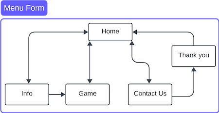
#### Menu 
* __Info__ - diplays information about the game inspiration, rules, and how to play instructions. 
* __Game__ - terminal game. 
* __Contact__ - displays contact details for anyone who would like to reach out. 
* __Thank you__ - pop up after submitting the contact form.  

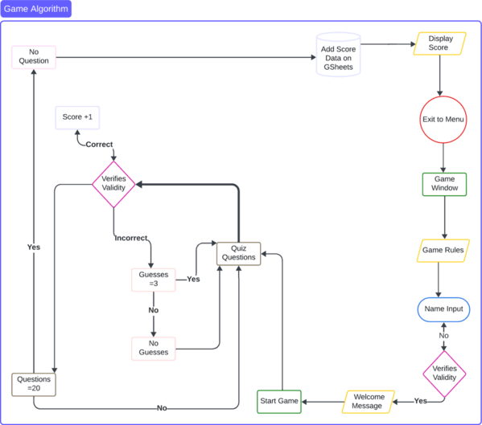 

[Table of Content](#table-of-content):arrow_up: 

## Project Design
### Planning Stage
#### Landing Window
#### Game Window
#### About Window 
#### Contact Us Window 

### Features

The game lands on the game window with the menu buttons above the game console. Each menu button is a dropdown window to display the information.

#### Landing Window

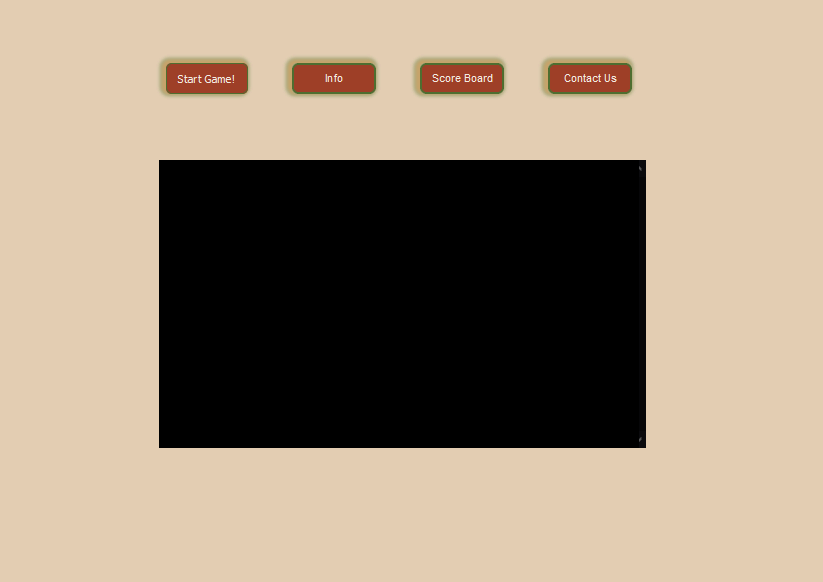

#### Menu Options

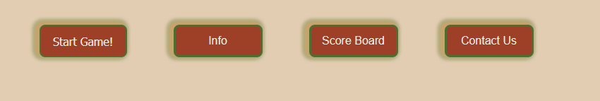

#### Start Game 

The start game button refreshes the game console window and starts the game.

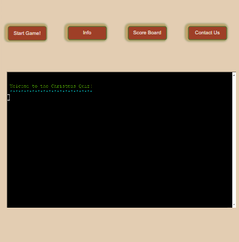

#### Info Page
Info button leads to a dropdown window, displaying the game information. This include a brief explanation for game inspiration, instructions how to play and hints for the game. At the bottom with an exit button, leading to the back to the landing window. 

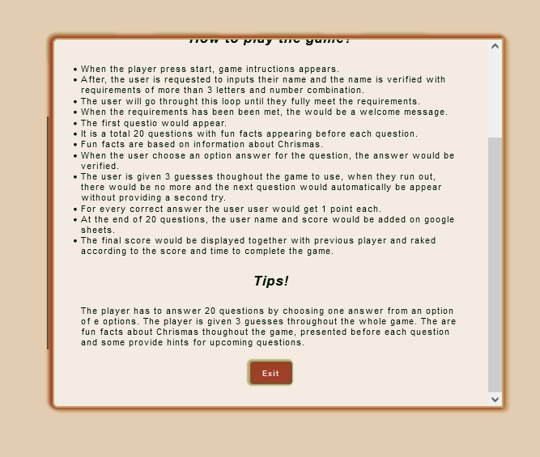

#### Score Board Page

The score board dropdown button leads to a window with all the game statistics. However because of lack of time it displays an empty table and on the next release it will display the previous game scores.  

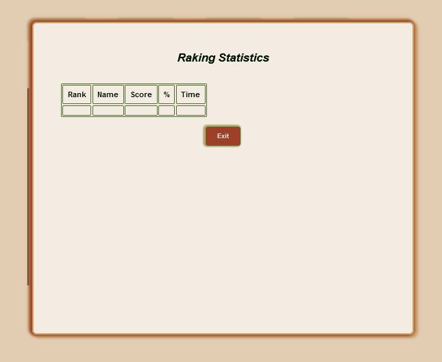

#### Contact Us Page

The contact us button leads to a form that the player can provide the feedback about the game. The form is meant to send information into google sheets however because of time contrains the feature is not included. On the next release will be included. The form has a submit button at the bottom, on submission it provides the user the respond wether the form has been submitted or not. And the exit button leads back to the landing page.

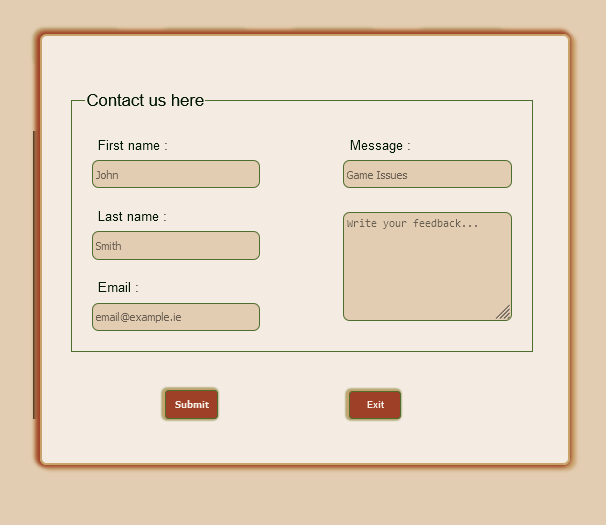

## Game Manual

Click here to view the game manual.

### Player Validation

The player would be asked to edit their name. The name would need to have a combination of more than 3 letters and numbers to be consired valid. Otherwise the player would be required to input their name until the name meets the requirements. 

### Main Menu

* __Start Game Button__ - It refreshes the console window.
* __Info Button__ - Opens the information dropdown window, leads back to the landing page. 
* __Score Board Button__ Displays the game statistics. 
* __Contact Us Button__- It opens the contact us form for players to give feedback.

### How the game works?

* When the player press start, game intructions appears. 
* After, the user is requested to inputs their name and the name is verified with requirements of more than 3 letters and number combination. 
* The user will go throught this loop until they fully meet the requirements.
* When the requirements has been been met, the would be a welcome message. 
* The first question would appear. 
* It is a total 20 questions with fun facts appearing before each question. 
* Fun facts are based on information about __Chrismas__.
* When the user choose an option answer for the question, the answer would be verified.
* The user is given 3 guesses thoughout the game to use, when they run out, there would be no more and the next question would automatically be appear without providing a second try.
* For every correct answer the user user would get 1 point each. 
* At the end of 20 questions, the user name and score would be added on google sheets. 
* The final score would be displayed together with previous player and raked according to the score and time to complete the game. 

### Scoreboard

Would display percentage score, name of player, time it took to complete the game and the player raking compared to previos player. 

### How to Play

The player has to answer 20 questions by choosing one answer from an option of e options. The player is given 3 guesses throughout the whole game. The are fun facts about Chrismas thoughout the game, presented before each question and some provide hints for upcoming questions.  

### Stats

Would compose of player's indivisual score, previous player's score ranking and compare the player to other players. The data would be stored on google sheets. 

 

 [Table of Content](#table-of-content):arrow_up: 

 ## Deployment 

Click here to view the deployment instruction to Heroku Cloud.

### Heroku
* Adding the project to [Heroku](https://dashboard.heroku.com/) would need to be done after the project has been completed building and the requiremnts file has been added with the project dependancies. 
* To do this after coding has been complete, on the terminal type __pip3 freeze requiremnts.txt__ a list of required dependancies for the project would be listed. 
* Copy and paste into the __requiremnts.txt. file__, add, commit and push to github. 
* Opern the [Heroku](https://dashboard.heroku.com/) website to log into your account.

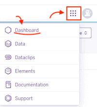

* After opening your account, click the menu on the right top-corner. 
* From the menu options choose the first onption __Dashboard__.

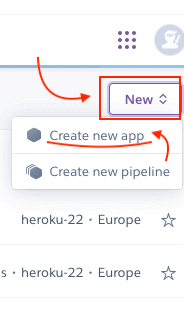
* Choose an app option, to create a new application. 

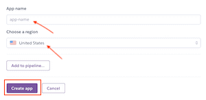

* When creating a new app, you would have to add a unique app name, choose your region and click __Create the App__. 

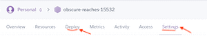

* Look at the menu options on the top and choose __Settings__ first.
* Here will be setting the auth file code, choosing the bulding pack for the environment and adding the __Port 8000__. 

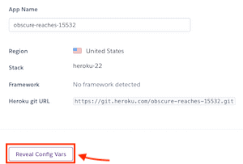
* Under Config Vars store any sensitive data in _JSON File__.
* Click on the __Configure__ to open.
* Here you would need to add two keys, first the __CREDS File__ holding the key auth access to add data on google sheets and __PORT 8000__ for anavailable page. 

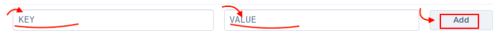

* Would need to type the __CREDS__ as key and add the __CREDS.JSON__ file code as the value. 
* Add click on add to save it. 
* Then type __PORT__ as key and add __8000__ as value.
* And click add to save it. 

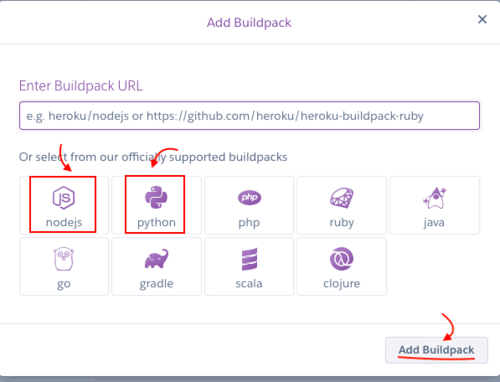

* Scroll down to adding the package for building environment. 
* For this project, you would need to choose __NODE.JS__ and __PYTHON__ to build the environment. 

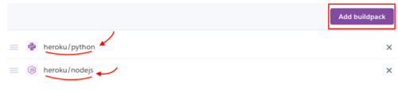
* The buildingpack would need to be in the right order as __PYTHON__ and __NODE.JS__  to follow as that is how I did it when uploading the project. 

* Scroll up back to the top menu and click on __Deploy__.

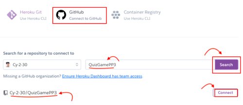

* Go to __Deploy__ and select __GitHub__ in __Deployment method__.
* Below the Github repository will appear with your github user account. 
* You can then enter your repository name, click __Search__ and then __Connect__ when it shows below.

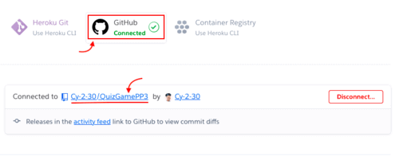

* Github would show in green that you are connected. 
* The repository name would appear to show you are connected and you could disconnect with the red corner button. 

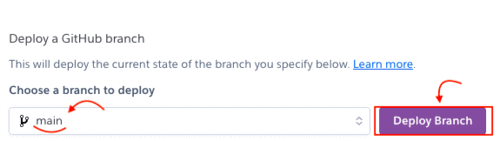

* If prefered, click on __Enable Automatic Deploys__, which keeps the app up to date with your GitHub repository
* Scroll down to choose the branch form github repository to deploy. 
* Once you have selected the branch, click __Deploy Branch__.

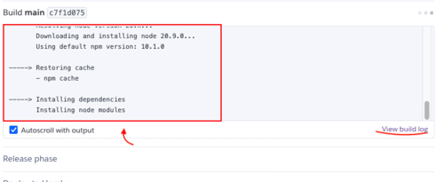

* Once you clicked __Deploy Branch__, it would take a minute to build the the environment for the app. 

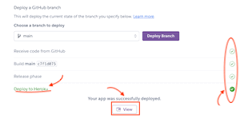

* Once everything is successfully deployed on cloud, you would see __Deployed to Heroku__ in green and everything else ticked in green. 
* However if you see any red errors, you need to go back to your code and check if there is anything you might have missed. 
* If you would like to view the app you could click on __View__ to open it live. 

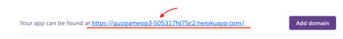

* The link to the live could be found under settings, when you scroll all the way down. 
* The link can be copied.

### Fork Repository

Follow the steps to fork the repository:

* Go to the [GitHub](https://github.com/Cy-2-30/QuizGamePP3) repository. 
* Locate the __Fork Button__ on the top-right and click it. 

### Clone Repository

You can clone the repository by following these steps:

* Go to the [GitHub](https://github.com/Cy-2-30/QuizGamePP3) repository. 
* Or you could select __Code__ above the code to clone.
* Select if you prefere to clone using HTTPS, SSH, or Github CLI and click the copy button to copy the URL to your clipboard.
* Open Git Bash.
* Change the current working directory to the one where you want the cloned directory
* Type git clone and paste the URL from the clipboard ($ git clone https://github.com/YOUR-USERNAME/YOUR-REPOSITORY) 
* Press Enter to create your local clone.

 

[Table of Content](#table-of-content):arrow_up: 

### Features Not Included
* The game does not rank all the players score when displaying the score.
* Menu chartflow has changed. 
    * The menu buttons are located above the terminal.
    * Each menu button (__Info, Score Board, Contact Us__) has dropdown window to display the information. The windows each has respective exit button leading back to main page.
    * The __Contact Us__ form does not have a window on exit but a feedback message regarding the form submission.
    * The form does not submit into google sheets. There was not enough time to resolve errors causing the form not to submit and on the next release the feature would be included. 

## Code Validating 

### Testing 