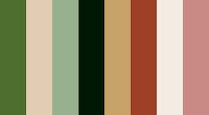

Who is in the __Festive Spirit__, __Chrismas Quiz__.

# Welcome to Python Project 3 Inpired by Chrismas Spirit. 

The project is a multiple question quiz game, created around the chrismas vocabulory and historic origin. It is a light-hearted fun game that can be played with friends or family. It is a fun and cheerful game, with educational fun facts. The programming languages used in this quiz are **HTML**, **CSS**, **Python** and **JavaScript**. To showcase what I have learned so far with the program.   

## Table of Content

1. [User Experience](#user-experience)
    1. [Project Goal](#project-goal)
    2. [User Story](#user-story)
    3. [Typography](#typography)
    4. [Flowchat](#flowchat)
2. [Project Design](#project-design)
    1. [Planning Stage](planning-stage)
        1. [Landing Window](#landing-window)
        2. [Game Window](#game-window)
        3. [About Us Window](#about-window)
        4. [Contact Us window](#contact-window)
    2. [Features](#features)
        1. [Landing window](#landing-page)
        2. [About ](#about-page)
        3. [Game Page](#game-page)
        4. [Contact Page](#contact-page)
3. [Technologies](#technologies)
    1. [Code Languages](#code-languages)
    2. [Frameworks Used](#frameworks-used)
    3. [Extra Support](#extra-support)
    4. [Technologies used for testing](#technologies-used-for-testing)
4. [Testing](#testing)
    1. [Debugging](#debugging)
    2. [Code Validation](#code-validation)
6. [Deployment](deployment)
7. [Acknowledgement](#acknowledgement)

## User Experience

### Project Goals 

* To have a fun, __Festive Spirit__, __Chrismas Quiz__ and engaging game. 
* To have fun entertaining game that is interactive to the user.
* To display the basic use of the Python language.
* To give user fun educational facts while playing.  
* To keep record of all the scores and rate them as per ranking.  
* To provide a game break down score record at the end. 
* To provide the necessary information to make the game clear and intuitive to play. 
* Provides input validation to help the user input the correct data and information. 
* The program should keep running until the user decides otherwise. 
* The user should have full control over the game.

### User Stories 

* As a user, I want to read information about the main objective of the game. 
* As a user, I want to easily understand what input is needed on each step. 
* As a user, I want to receive clear feedback in case I provide the wrong input. 
* As a user, I want a detailed final score at the end.  
* As a user, I want to see the comparison of my final score with other players, as well as others final scores at the end of the game.  
* As a user, I want to intuitively navigate through the website. 
* As a user, I want to give my feedback at the end of the game.  
* As a user, I want to reach out to the game creator. 

### Color Scheme Used 

I choose chrismas theme to represent the festive seasonal spirit. The color choice of the images and colors used are chrismas colors inpired. 

__CSS HEX__
* __Fern-Green__: #4e6e30ff;
* __Dun__: #e3cdb2ff;
* __Cambridge-Blue__: #97b18eff;
* __Dark-Green__: #011805ff;
* __Lion__: #c8a369ff;
* __hestnut__: #9e3f27ff;
* __Linen__: #f4ece2ff;
* __Old-Rose__: #c98a85ff;

### Flowchart
Menu would be a drop down form displaying the information about the game. 

#### Menu 
* __Info__ - diplays information about the game inspiration, rules, and how to play instructions. 
* __Game__ - terminal game. 
* __Contact__ - displays contact details for anyone who would like to reach out. 
* __Thank you__ - pop up after submitting the contact form.  

 

#### Team Players 
 

[Table of Content](#table-of-content):arrow_up: 

## Project Design

### Planning Stage
 

#### Landing Window

#### Game Window

 

#### About Window 

.  

#### Contact Us Window 

### Features

#### Landing Form

#### Game Form

#### Information Game Form

#### Contact Us Form
